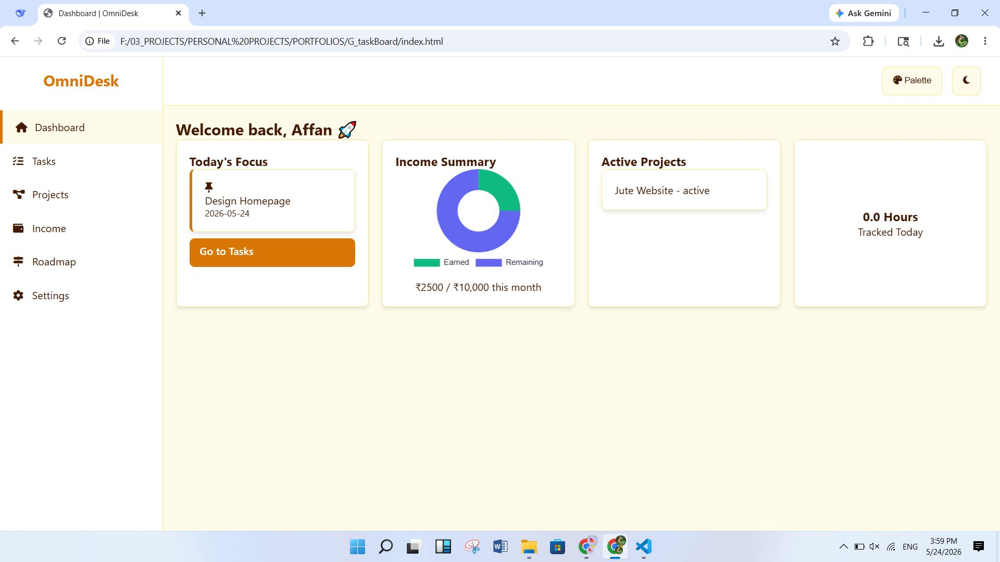
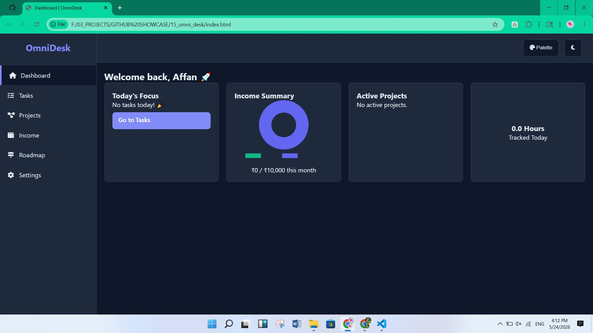
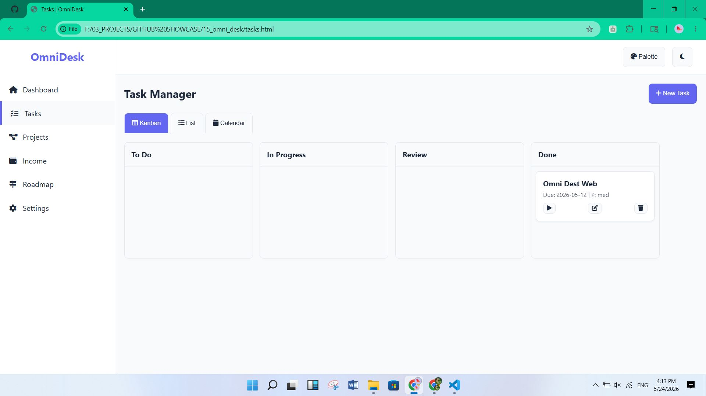
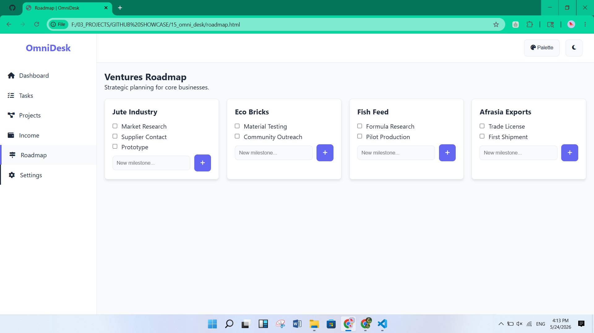

# 🧠 OmniDesk – Personal Task & Project Board

**OmniDesk** is a high-performance personal management dashboard built for tracking tasks, projects, income, and strategic business roadmaps. It features a modern, responsive UI with dynamic themes and local data persistence — **no backend required**.



---

# ✨ Core Features

## 📊 Dynamic Dashboard
A clean overview of:
- Daily focus tasks
- Monthly income progress
- Active project statuses
- Upcoming deadlines

---

## 🗂️ Multi-View Task Manager
Manage tasks using:
- **Kanban View**
- **List View**
- **Calendar View**

Includes smooth drag-and-drop functionality powered by **SortableJS**.

---

## 📅 Project Timelines
Built-in Gantt chart system for:
- Project duration tracking
- Deadline management
- Completion percentages
- Progress visualization

---

## 💰 Income Tracking
Track:
- Monthly earnings
- Yearly goals
- Financial progress

Interactive charts powered by **Chart.js**.

---

## 🧭 Ventures Roadmap
Strategically organize:
- Startup ideas
- Business milestones
- Growth plans
- Long-term objectives

---

## 🎨 Customization
Features:
- Light & Dark modes
- Multiple color palettes
- Saved browser preferences
- Responsive modern UI

---

## 📁 Data Portability
Easily:
- Export workspace data as JSON
- Import saved workspaces
- Backup all tasks & projects locally

---

# 🛠️ Tech Stack

| Technology | Purpose |
|------------|---------|
| HTML5 / CSS3 | Structure & responsive layout |
| Vanilla JavaScript (ES6+) | Core logic & DOM manipulation |
| Chart.js | Income & progress charts |
| SortableJS | Drag-and-drop task management |
| LocalStorage | Persistent browser storage |

---

# 🚀 Setup & Usage

## 1️⃣ Clone the Repository

```bash
git clone https://github.com/affan675/15_omni_desk.git
```

---

## 2️⃣ Navigate Into the Folder

```bash
cd 15_omni_desk
```

---

## 3️⃣ Open the Project

Simply open:

```bash
index.html
```

in your browser.

No installation or backend setup required.

---

# 📂 Project Structure

```plaintext
15_omni_desk/
│
├── index.html
├── style.css
├── script.js
├── assets/
├── screenshots/
└── data/
```

---

# ⚡ Highlights

- Fully responsive
- Offline-friendly
- Lightweight & fast
- No frameworks required
- Modern dashboard UI
- LocalStorage persistence
- Interactive visualizations

---

# 🌟 Ideal For

- Students
- Freelancers
- Startup founders
- Personal productivity systems
- Business planning
- Side project management

---

# 🔮 Future Improvements

Planned additions:
- Cloud synchronization
- Team collaboration
- Notifications & reminders
- AI productivity assistant
- Firebase/Supabase support
- Mobile application version

---

# 📸 Screenshots

## Dashboard


## Kanban Board


## Timeline View


---

# 📄 License

This project is licensed under the **MIT License**.

---

# 👨‍💻 Author

Developed with passion by **Affan**.

If you like this project, consider giving it a ⭐ on GitHub.